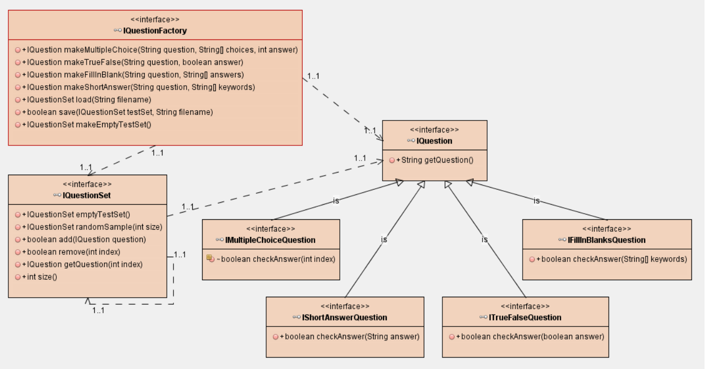

# CSC322
Class projects for CSC322 - Object Oriented Programming in Java

## Session 4

### Assignment (cont. from Session 3)

An implementation of a provided set of interfaces. A larger project that provides CLI to make and take tests.


You first use the TestMaker program to make a test, then you use the TestTaker program to take a test.
```sh
cd csc322
javac -d build com/jsoftware/test/TestMaker.java
java -cp build com.jsoftware.test.TestMaker

javac -d build com/jsoftware/test/TestTaker.java
java -cp build com.jsoftware.test.TestTaker
```

### Exercise

A simple demonstration of Object I/O Streams

Compile and Run:
```sh
cd csc322
javac -d build com/zandgall/csc322/session4/exercise/BinaryIO.java
java -cp build com.zandgall.csc322.session4.exercise.BinaryIO
```

### Discussion

A humorous maze generator, made without consulting any outside resources like documentation or other projects or even IDE suggestions. With the only exception being a place to copy and paste the characters used to display the maze.

Compile and Run:
```sh
cd csc322
javac -d build com/zandgall/csc322/session4/discussion/GallDiscussion4.java
java -cp build com.zandgall.csc322.session4.discussion.GallDiscussion4
```

## Session 3

### Exercise

A simple project that prints the vertex form of a parabola entered by the user. It makes use of a custom "Rational" class that extends Number, it has methods to add, subtract, divide, and multiply with other numbers.
(If this were a C++ assignment, I could even implement -+/* as operators ;) )

Compile and Run:
```sh
cd csc322
javac -d build com/zandgall/csc322/session3/exercise/Parabola.java
java -cp build com.zandgall.csc322.session3.exercise.Parabola
```

### Discussion

An example that demonstrates ways to use abstract classes. Including having a list of different child classes, holding common fields and methods, and calling common methods without having to know what the child class is.

Compile and Run:
```sh
cd csc322
javac -d build com/zandgall/csc322/session3/discussion/GallDiscussion3.java
java -cp build com.zandgall.csc322.session3.discussion.GallDiscussion3
```

## Session 2

### Assignment

A project that loads a text file to parse an Inventory, and provides a command line interface to list different queries of items.

Compile and Run:
```sh
cd csc322
javac -d build com/zandgall/csc322/session2/assignment/Main.java
java -cp build com.zandgall.csc322.session2.assignment.Main
```
(Make sure that inventory.txt is in your working directory)

### Discsussion

A small class that overrides the `Object.equals()` function, with a demonstration of it. Used in a class dicussion.

Compile and Run:
```sh
cd csc322
javac -d build com/zandgall/csc322/session2/discussion/Comparison.java
java -ea -cp build com.zandgall.csc322.session2.exercise.Comparison
```

### Exercise

A simple 'shuffle' function and demonstration. This little program creates an ArrayList and shuffles it several times. The shuffling is performed by swapping every entry in the list with a randomly picked entry elsewhere in the list. Like so:

```pseudo
for (i from 0 to size of list)
    swap list[i] with list[random from 0 to size of list]
```

Compile and Run:
```sh
cd csc322
javac -d build com/zandgall/csc322/session2/exercise/Shuffle.java
java -cp build com.zandgall.csc322.session2.exercise.Shuffle
```

## Session 1

### Assignment 1

A bank-like `Account` class with data points for a balance, interest rate, date created, and an ID. Getters and setters for some, with a few special methods to modify or retrieve pieces of information.
Along with an `ATM` class with a main method that allows a user to interact with 10 different Account instances using the terminal.

Compile and Run: 
```sh
cd csc322
javac -d build com/zandgall/csc322/session1/assignment1/ATM.java
java -cp build com.zandgall.csc322.session1.assignment1.ATM
```

### Exercises

A `Time` class that stores an hour, minute, and second as integers. It has methods for getting and setting all three, along with a method that sets them automatically based on a Unix timestamp.
The `TimeTest` class has a main method that initializes three Time instances, and prints their resulting hour, minute, and second.
Also includes a chart that shows how the Time class is designed.

Compile and Run: 
```sh
cd csc322
javac -d build com/zandgall/csc322/session1/exercises/TimeTest.java
java -cp build com.zandgall.csc322.session1.exercises.TimeTest
```
